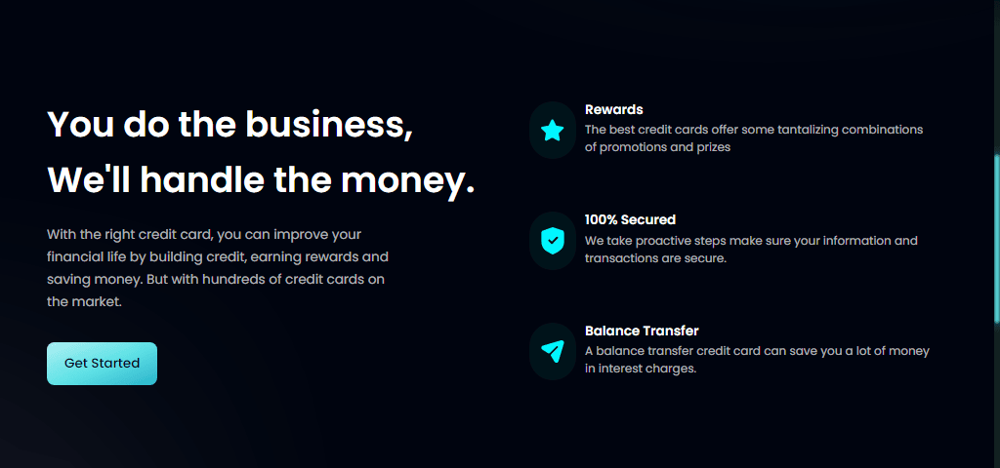

# 🏦 Hoobank

### a Fully Responsive Website with Modern UI/UX

## Link 🔗 [https://charactermi.github.io/hoobank_project](https://charactermi.github.io/hoobank_project)

 

# Preview

 

# Mobile Responsive

# Technologies

<ul>
    <li>
        
    </li>
    <li>
        
    </li>
    <li>
        
    </li>
    <li>
        
    </li>
    <li>
        
    </li>
</ul>
